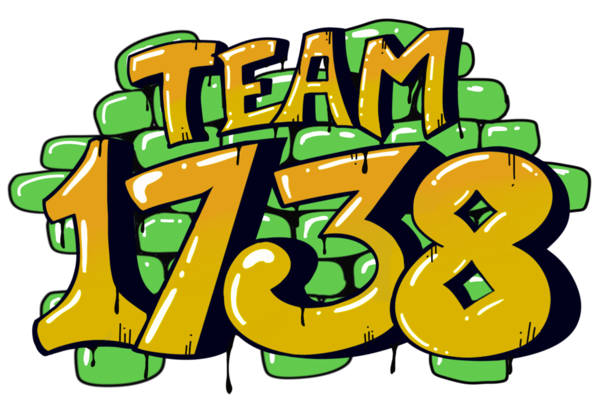
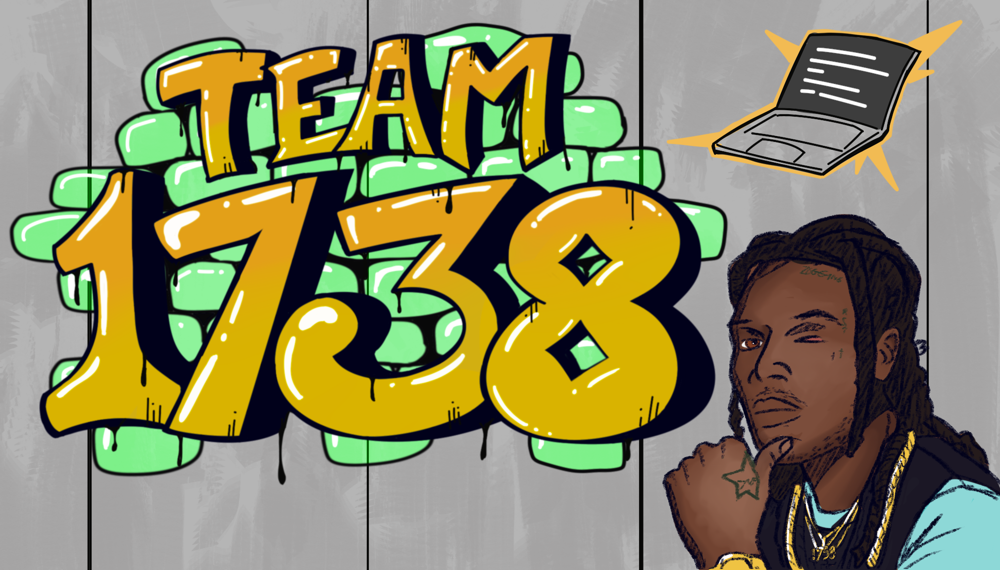
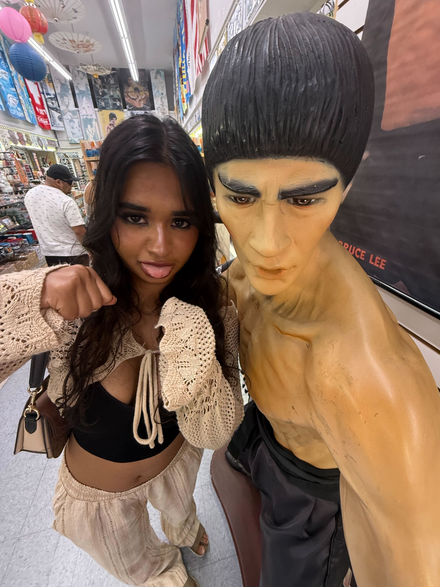
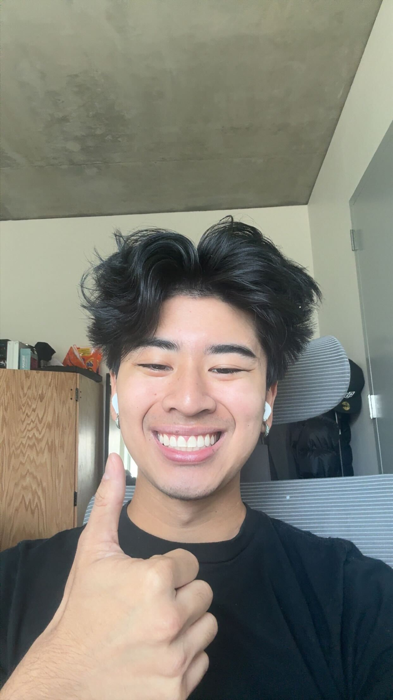
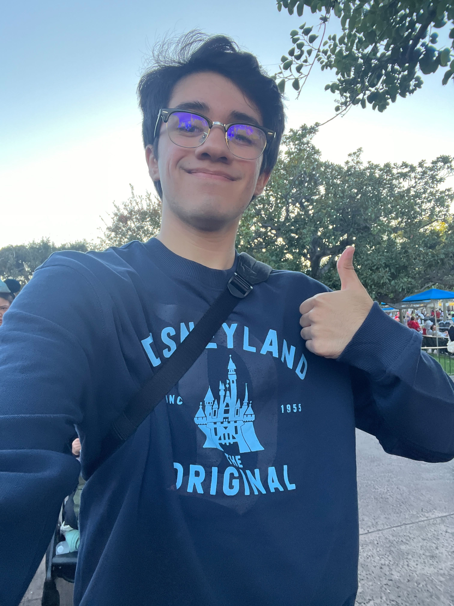
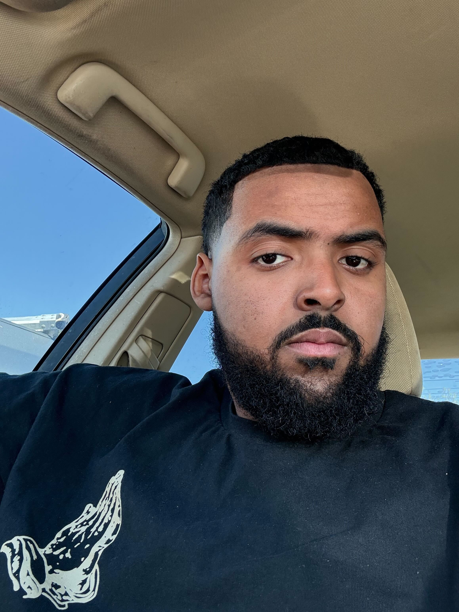
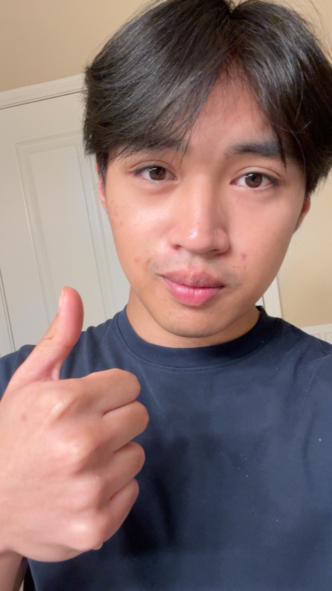
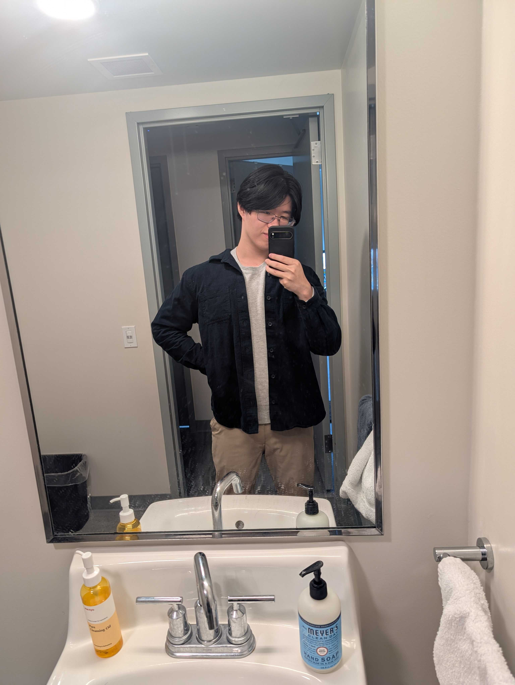
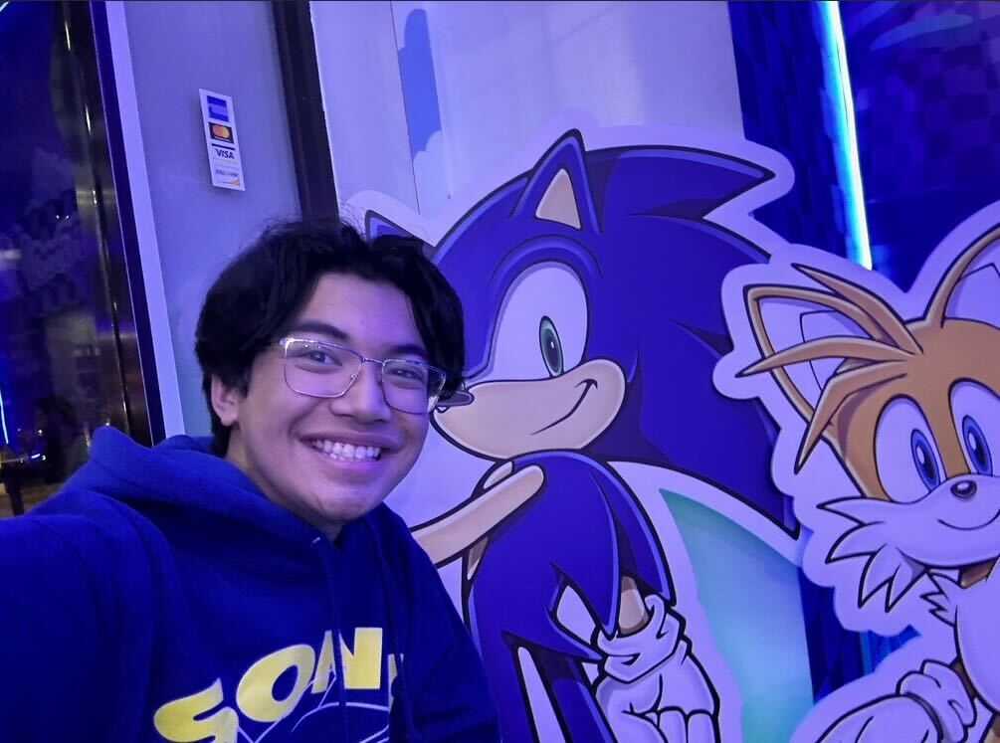
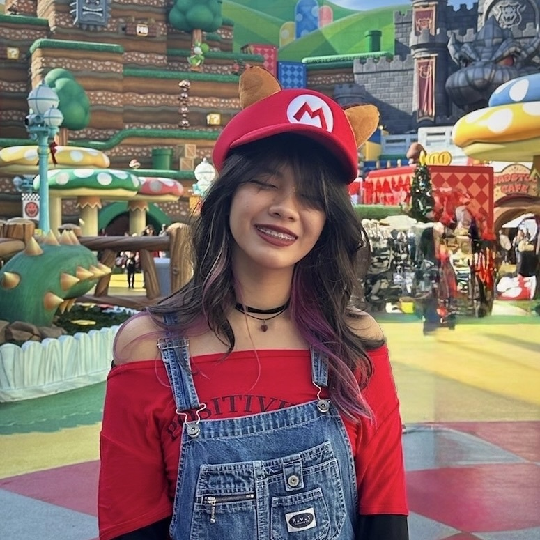

<h1 align="center">
  
</h1>

<em></em>

  

<em>Team 17 — everyone in one frame</em>

---

## 🌟 Our Values
- Prioritizing communication and staying aligned as a team  
- Collaborating effectively and respectfully  
- Learning how real-world software teams function  
- Supporting each other whenever needed  
- ~~Creating a resume builder project~~

---

## 👥 Team Roster

---

## Team Leads

### Sanjana Kalarickal

- **Roles:** Team Lead / Testing  
- **Major:** Computer Science  
- **Year:** 2nd Year  

> "Every time I touch the basketball, my fingers keep paying the price (five sprains so far)"

🔗 [GitHub](https://github.com/sanjana1976)

---

### Andrew Pham

- **Roles:** Team Lead / Testing
- **Major:** Computer Science  
- **Year:** 3rd Year  

> "I once fit 5 Krispy Kreme donuts in my mouth at once"

🔗 [GitHub](https://github.com/AndrewPhamCode)

---

## 🎨 Frontend

### Paul Jimenez

- **Role:** Frontend  
- **Major:** Computer Science  
- **Year:** 2nd Year  

> "I once ate 24 brownies in one night. It was horrible but the memories are worth it."

🔗 [GitHub](https://github.com/pijcucsd28)

---

### Mohamed Ali

- **Role:** Frontend  
- **Major:** Computer Science  
- **Year:** 4th Year  

> "Oldest of 8 kids and huge LeBron fan"

🔗 [GitHub]()

---

## ⚙️ Backend

### Sohum Mehta

- **Role:** Backend  
- **Major:** Computer Science  
- **Year:** 2nd Year  

> "When COVID started I needed a haircut badly, but all barbershops were closed, so I went fully bald (never again)"

🔗 [GitHub](https://github.com/sohummehta)

---

### Luke Deverian

*No portrait uploaded yet.*

- **Role:** Backend  
- **Major:** Computer Science  
- **Year:** N/A  

> N/A  

🔗 [GitHub](https://github.com/lukemdeverian)

---

### Aayan Lakhani

*No portrait uploaded yet.*

- **Role:** Backend  
- **Major:** Computer Science  
- **Year:** N/A  
> N/A  

🔗 [GitHub](https://github.com/AayanLakhani)

---

### Ivan Del Rio

- **Role:** Backend  
- **Major:** Computer Science  
- **Year:** 3rd Year  

> "I can windmill breakdance"

🔗 [GitHub](https://github.com/BariBariGood)

---

### Raymond Chen

- **Role:** Backend  
- **Major:** Computer Science  
- **Year:** 3rd Year  

> "Got 2 fortune cookies telling me to order steak medium well / well done the day after getting food poisoning from rare steak TwT"

🔗 [GitHub](https://github.com/Satellamoon)

---

## 🎨 Design

### Jorell Jusay

- **Role:** Design  
- **Major:** Computer Science  
- **Year:** 3rd Year  

> "I think of coding as the non-fantasy equivalent of spell casting to add a splash of whimsy"

🔗 [GitHub](https://github.com/JoJusay)

---

### Cathlyn Goldberg

- **Roles:** Design / Frontend  
- **Major:** Computer Science  
- **Minor:** Design  
- **Year:** 2nd Year  
> "I have a talent for opening the fridge multiple times expecting new food to appear."

🔗 [GitHub](https://github.com/2090lyn/)

---

<!--
Still need:
- Luke & Aayan year info
- Luke & Aayan portraits (optional)
-->
